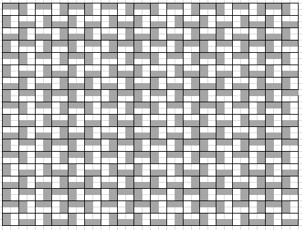
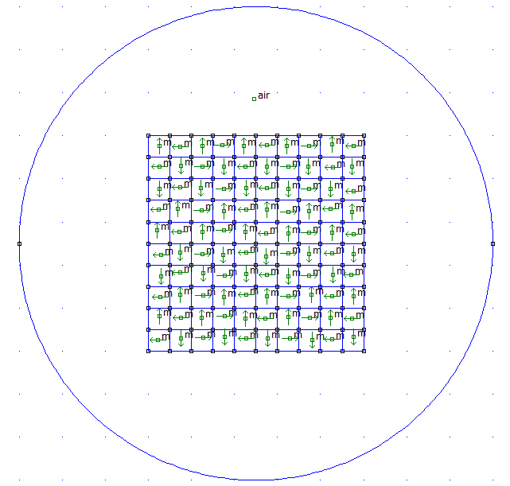

# Halbach-Dimension

This repository explores extending the Halbach array configuration beyond the conventional 2D planes, showcasing innovative approaches to maximize its potential.

## Disclaimer
This document offers a unique perspective on the utilization and analysis of Halbach arrays. It does not focus on mathematical or equation-based representations but rather on exploring the broader potential of Halbach arrays. The simulations and theories presented are based on computational models and have not been fully validated through experimental testing. Therefore, readers should be mindful of these limitations and exercise caution when applying these concepts to real-world implementations.

## Introduction
The [Halbach array](https://en.wikipedia.org/wiki/Halbach_array) is a fascinating assembly of magnets. Despite extensive analysis over the years, discussions about it often remain limited to its 'strong' and 'weak' sides. Even the so-called Halbach 'planes' are typically viewed based on sides. However, various simulations and configurations of the Halbach array in 2D planes suggest that there is more to this array in terms of dimensions.

Recognizing this, we used reinforcement learning to determine configurations with the highest field intensity. Interestingly, these configurations closely resemble a Halbach array but with certain adjustments.

## Repository contents
- <a href="https://github.com/GyaviWalls/halbach-dimension/tree/main/imgs">imgs</a>   ->   contains simulation images or snapshots taken to illustrate the concept
- <a href="https://htmlpreview.github.io/?https://github.com/GyaviWalls/halbach-dimension/blob/152cab65ad3283eaf4547043a875f502229b70fa/content.html">content.html</a>  ->  The primary file for user viewing and reading.
- <a href="https://github.com/GyaviWalls/halbach-dimension/blob/main/content.ipynb">content.ipynb</a>  ->   jupyter notebook file used for executing the code
- <a href="https://github.com/GyaviWalls/halbach-dimension/blob/main/playground.ipynb">playground.ipynb</a>  ->  testing area for scripting code to be used in the implementation
- *.fem  ->  simulation files implemented using the <a href="https://www.femm.info/wiki/HomePage">femm simulation software</a>

## Example
Below is a tabular representation of one of the reviewed configurations, displaying the pole diagram, the simulation representation, and the resultant field diagram.
| Pole Diagram | Direction Diagram | Field Diagram |
| --------------- | --------------- | --------------- |
|  |  |  |

## Future consideration
Future studies should focus on setups where the magnetic field of each individual magnet can be changed at will. This would allow for a detailed examination of how magnetic patterns shift from one permutation to another and back. Such studies could lead to significant advancements by providing deeper insights into the dynamic nature of magnetic fields.

## Caveats
It's unfortunate that the markdown within the <a href="https://github.com/GyaviWalls/halbach-dimension/blob/main/content.ipynb">contents jupuyter notebook file</a> can't be rendered. Therefore, I recommend viewing the images using the [contents HTML file](https://htmlpreview.github.io/?https://github.com/GyaviWalls/halbach-dimension/blob/152cab65ad3283eaf4547043a875f502229b70fa/content.html) file instead.
